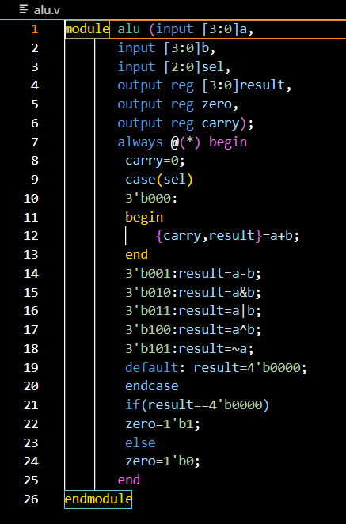
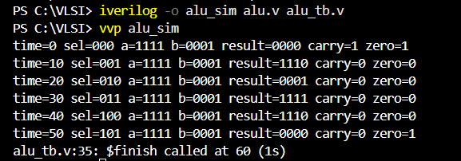

# 4-Bit ALU in Verilog

A 4-bit Arithmetic Logic Unit (ALU) designed and verified using Verilog HDL.

## Features

- Addition
- Subtraction
- Bitwise AND
- Bitwise OR
- Bitwise XOR
- Bitwise NOT

## Operations

| Select | Operation |
|---------|---------|
| 000 | Addition |
| 001 | Subtraction |
| 010 | AND |
| 011 | OR |
| 100 | XOR |
| 101 | NOT |

## Status Flags

### Carry Flag
Indicates overflow during addition.

Example:

1111 + 0001 = 10000

Result = 0000

Carry = 1

### Zero Flag
Set when the ALU result is 0000.

Example:

1111 + 0001

Result = 0000

Zero = 1
## Screenshots

### ALU Design

### Simulation Output

## Tools Used

- Verilog HDL
- Icarus Verilog
- VS Code

## Files

- alu.v : ALU design
- alu_tb.v : Testbench

## Author

Aaryan Navegiray
